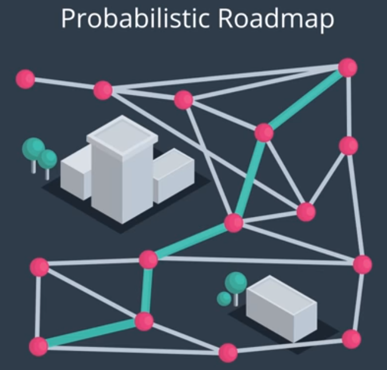

# AAE_Notebook_013_ProbabilisticRoadmap
Now that we have gone over random sampling in a 2.5D environment, in this notebook we have what we need to construct a 3D, graph-based representation of the feasible parts of the configuration space.

In this notebook we're going to implement a probabilistic roadmap using the following steps:
  1. Sample states at random
  2. Discard states that collide with obstacles
  3. Build a graph and run a search

We already know how to sample spaces at random and discard states that collide with obstacles; but, we also need the action space. In 2D, we used a line-drawing algorithm. In 3D, we can use the same approach.

We don't actually need to construct a 3D grid; rather, we just need to step across a discretized line and check for collisions. In principle, we can use the same Bresenham algorithm as before. 

In the previous sampling exercise, we saw that with the python [shapely library](https://shapely.readthedocs.io/en/stable/manual.html) it's relatively easy to cast our obstacles as polygon objects and test for collision with points in a 2D plane. Then, by comparing the height of the obstacle with the z-dimension of the point in question, we could discard states in collision and retain all candidate states in free space.

In this exercise, we'll connect the randomly sampled states to create a graphe representation of the free space environment, run a search, and find a path from start to goal.

Using the [KD Tree](https://en.wikipedia.org/wiki/K-d_tree) data structure can help to alleviate the inefficiency of naively checking for collision between all points by allowing us to quickly identify nearest neighbors to a point or polygon.

Next, we'll use [networkx](https://networkx.github.io/) to generate a graph of nodes from points that lie in free space and determine the edges of the graph. 
